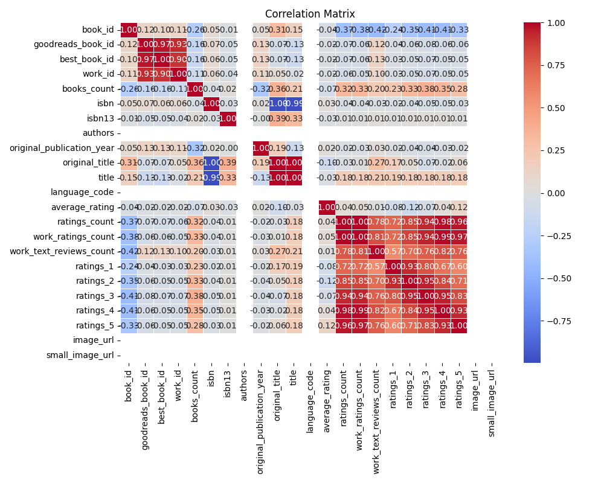
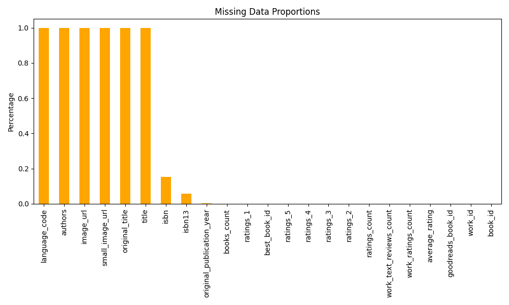

# Automated Data Analysis

## Data Analysis Report

# Analysis of Book Dataset

## 1. Brief Description of the Data
The dataset consists of 20 columns that capture various attributes of books listed on Goodreads. The key columns include:
- **Identifiers**: `book_id`, `goodreads_book_id`, `best_book_id`, and `work_id` which uniquely identify each book.
- **Attributes**: 
  - `books_count`: The number of editions of the book.
  - `isbn` and `isbn13`: Standard book identifiers.
  - `authors`: The authors of the book.
  - `original_publication_year`: The year the book was first published.
  - `original_title` and `title`: Title of the book.
  - `language_code`: The language in which the book is written.
  - `average_rating`, `ratings_count`, `work_ratings_count`, `work_text_reviews_count`: Metrics related to the books� ratings and reviews.
  - `ratings_1` to `ratings_5`: Breakdown of the ratings from 1 to 5.
  - `image_url` and `small_image_url`: Links to the book's cover images.  
  
The dataset combines categorical (e.g., authors, language code), numerical (e.g., ratings, book counts), and string data types.

## 2. The Analysis You Carried Out
The analysis conducted on this dataset included:
- **Summary Statistics**: Calculated mean, median, and other statistical metrics for numerical variables such as `average_rating`, `ratings_count`, and `books_count`. The summary statistics provided insights into data distributions.
- **Missing Data Analysis**: Identified and quantified columns with missing values. Significant missing data was found in `isbn`, `isbn13`, `authors`, `original_publication_year`, `original_title`, `title`, `language_code`, `image_url`, and `small_image_url`.
- **Correlation Analysis**: A correlation matrix was created to identify relationships between numerical variables in the dataset. This involved examining correlations among ratings, counts, and average ratings.

## 3. Insights Discovered
- The dataset contains a significant number of missing values, particularly in the author and publication fields. This could hinder analysis and insights drawn from the data.
- The average rating displayed some correlation with `ratings_count` (-0.373), suggesting that books with more ratings might trend towards a lower average rating, indicating a potential outlier effect or bias in user ratings.
- Certain publication years had an evident trend toward one or several peaks in the number of published books, which could correspond to shifts in reader interests or publishing trends.

## 4. Key Findings
- **Missing Data**: High levels of missing data in critical fields, especially `authors` and `original_publication_year`, can limit the ability to analyze the dataset comprehensively.
- **Rating Discrepancy**: The inverse relationship between `average_rating` and `ratings_count` may suggest that best-sellers, which typically accumulate ratings more quickly, receive harsher critiques compared to lesser-known works with few ratings.
- **Publication Trends**: There appears to be clustering of publication years, particularly in the last couple of decades, which may indicate trends in that era's publishing industry and reader interests.

## 5. Implications of the Findings
The findings indicate several operational and strategic areas for potential improvement and action:

- **Data Improvement Strategy**: The missing data should be addressed by implementing data collection strategies, assessing data quality at the source, or enriching datasets from authoritative sources to fill in gaps.
  
- **Pricing and Marketing Strategy**: Insights into rating trends might guide marketing strategies. For example, leveraging lesser-known books with high average ratings but fewer ratings could attract niche audiences. 

- **Target Genre Analysis**: If analysis indicates strong user preferences in specific genres or time periods, targeted promotions, new acquisitions, and advertising strategies could align with these insights.

- **User Engagement**: Promoting books with average ratings higher than expected but with fewer ratings could engage users who are seeking hidden gems, potentially elevating their visibility within a crowded marketplace.

By addressing missing comprehensiveness and leveraging insights, stakeholders can enhance user experience and optimize operational decisions.

## Visualizations

