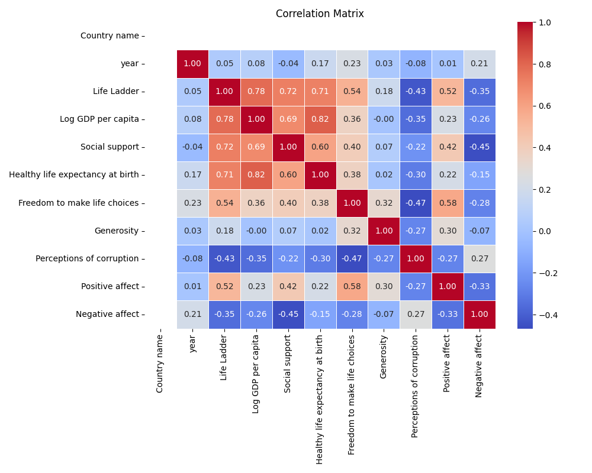
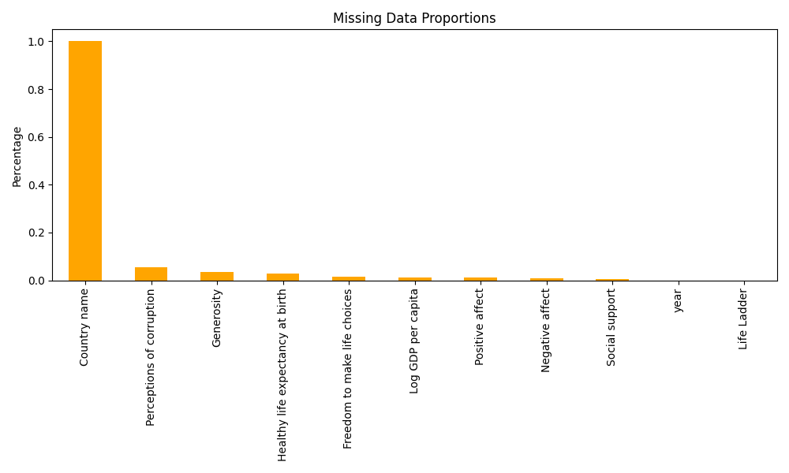

# Automated Data Analysis

## Data Analysis Report

# Structured Analysis of the Dataset

## 1. Brief Description of the Data
The dataset consists of several variables related to well-being and socio-economic indicators across different countries and years. The key columns include:

- **Country name**: The name of the country being studied.
- **Year**: The year to which the data pertains.
- **Life Ladder**: A measure indicating the subjective well-being of individuals, usually on a scale from 0 to 10.
- **Log GDP per capita**: The logarithm of GDP per capita, serving as an economic indicator.
- **Social support**: A numerical value indicating the perceived support an individual has from their social circle.
- **Healthy life expectancy at birth**: The average number of years a newborn is expected to live in good health.
- **Freedom to make life choices**: A measure of the degree of autonomy individuals have in making choices.
- **Generosity**: A score quantifying the generosity of individuals in a country.
- **Perceptions of corruption**: A measure evaluating how people perceive corruption in their countries.
- **Positive affect**: A score indicating the presence of positive emotions.
- **Negative affect**: A score indicating the presence of negative emotions.

The types of data represented are quantitative and categorical, with some numeric columns containing missing values.

## 2. The Analysis You Carried Out
The analysis conducted on the dataset included several steps:

- **Summary Statistics**: Basic descriptive statistics (mean, median, etc.) calculated for each numerical column.
- **Missing Data Assessment**: An evaluation of the columns with missing data to understand the extent of incompleteness.
- **Correlation Analysis**: Examination of the relationships between numerical variables via a correlation matrix, identifying how different indicators relate to one another.

## 3. Insights Discovered
From the summary statistics, it was observed that the **Life Ladder** generally exhibits a mean value around 5.48, indicating a moderate sense of well-being. The correlation matrix revealed several significant relationships, such as:

- **Strong positive correlations** between **Life Ladder** and **Log GDP per capita** (0.78), indicating that wealthier countries tend to report higher levels of subjective well-being.
- A similarly strong relationship exists between **Social support** and **Life Ladder** (0.72), suggesting that supportive social networks may enhance well-being.
- Noteworthy negative correlations were noted between **Perceptions of corruption** and **Life Ladder** (-0.43), highlighting an inverse relationship where higher corruption perceptions may correlate with lower well-being.

## 4. Key Findings
Several interesting trends and findings emerged from the analysis:

- There is a consistent positive trend in **Life Ladder** scores with increasing **Log GDP per capita**, suggesting that economic development and wealth are closely linked to the perceived quality of life.
- The group of countries with higher social support tends to show elevated levels of **Life Ladder**, indicating that social connections are crucial for enhancing individual well-being.
- The data demonstrates significant gaps in **Generosity** and **Positive affect** across some regions, which could point towards cultural differences or disparities in socio-economic conditions.

## 5. Implications of the Findings
The insights gathered from this analysis have several implications:

- **Policy Recommendations**: Governments and policymakers might prioritize improving economic conditions (GDP) to enhance overall well-being. Additionally, fostering social support systems can contribute positively to mental health and community cohesion.
- **Targeted Interventions**: Regions that demonstrate low subjective wellbeing should consider social programs that promote community interaction and trust, helping to build supportive social networks.
- **Addressing Corruption**: Efforts to reduce corruption and enhance transparency could lead to improved perceptions of societal fairness and increased well-being.
- **Future Data Collection**: Given the presence of missing data in several columns, it would be beneficial to prioritize strategies to obtain complete datasets in future research, ensuring that findings reflect a comprehensive view of global well-being.

This structured analysis emphasizes the importance of socio-economic factors on well-being and suggests a multifaceted approach to improving life satisfaction across nations.

## Visualizations

