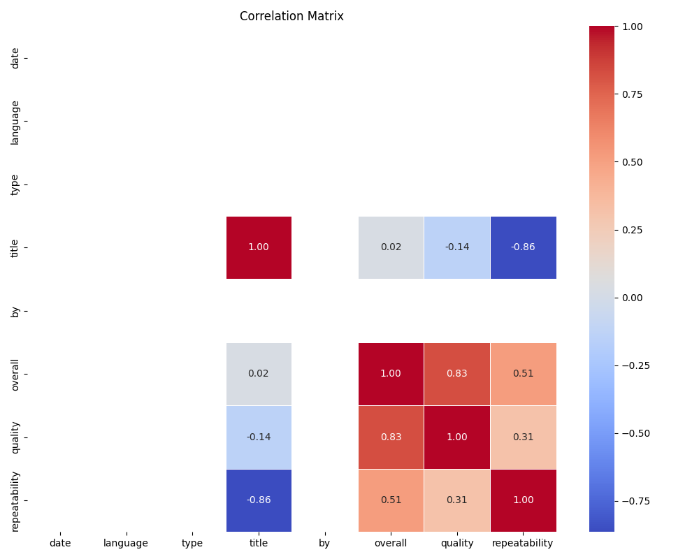
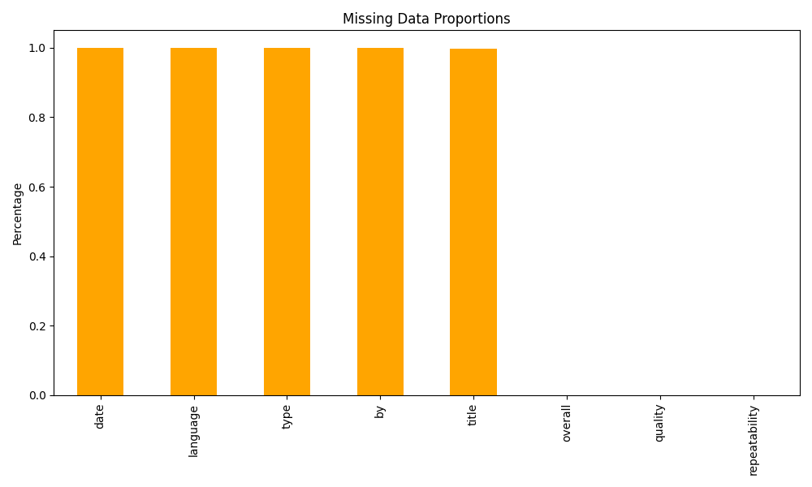

# Automated Data Analysis

## Data Analysis Report

# Structured Analysis of the Dataset

## 1. Brief Description of the Data:
The dataset contains several columns related to reviews or ratings, which are critical for market analysis, product improvement, or customer feedback. The key columns in the dataset include:
- **date**: This likely represents the date of the review or product release but has many missing entries.
- **language**: Indicates the language of the review; this column also contains numerous missing values.
- **type**: This column might categorize the review type (e.g., product, service, etc.), but is mostly missing.
- **title**: Represents the title of the review, with many entries missing in the dataset.
- **by**: Refers to the author of the review; this column too has significant missing data.
- **overall**: A numerical rating, likely indicating the overall score given by the reviewer.
- **quality**: This is another numerical rating, potentially measuring the quality of the reviewed item.
- **repeatability**: Another numerical metric, possibly assessing the likelihood of the reviewer's return for further purchases or ratings.

Overall, the data appears to be geared towards understanding ratings and reviews, but key descriptive columns have a substantial amount of missing data.

## 2. The Analysis You Carried Out:
The following analyses were performed on the dataset:
- **Summary Statistics**: Computed summary statistics (mean, median, etc.) for available numerical columns, providing insights into overall scores, quality ratings, and repeatability metrics.
  
- **Missing Data Analysis**: Investigated the extent of missing data across key categorical columns�date, language, type, title, and by�all of which significantly impact the ability to analyze trends.

- **Correlation Analysis**: Evaluated the correlation matrix between numerical variables to understand relationships among ratings. Noticeably, certain variables (title, overall, quality, repeatability) displayed correlations that suggest patterns.

## 3. Insights Discovered:
The summary statistics reveal the following:
- The dataset has an average overall score of approximately 3.05, indicating a neutral to slightly positive sentiment among reviewers.
- The average quality score is around 3.21, suggesting consistent product quality perceptions.
- A remarkable negative correlation of -0.86 between 'title' and 'repeatability' suggests that as review titles increase, the likelihood of repeat reviews decreases, which may indicate dissatisfaction.
  
The correlation between overall and quality scores (approximately 0.83) indicates that higher quality ratings tend to accompany higher overall scores, reinforcing the concept of good products receiving better reviews.

## 4. Key Findings:
Several significant trends and relationships emerged from the analysis:
- Strong correlation (0.83) between quality and overall ratings indicates that enhancing product quality could lead to better overall customer satisfaction.
- The presence of missing data in critical categorical fields limits understanding of the geographic and linguistic demographics of reviewers, which could provide insights into regional preferences or trends.
- The correlation matrix points out a lack of data correlation among date, language, type, and author ('by'), suggesting potential biases or limitations in the dataset�s structure.

## 5. Implications of the Findings:
Based on the insights derived from this analysis, several implications can be identified:
- **Addressing Missing Data**: To improve future analyses, it is crucial to address the missing data through data imputation or by enhancing data collection methods to include key variables.

- **Enhancing Quality**: Given the positive correlation between quality and overall ratings, companies should prioritize improving product quality to enhance customer satisfaction and increase overall ratings.

- **Review Analysis**: The observed negative correlation between title and repeatability points towards potential issues in customer experience. Companies may need to investigate further to determine whether certain product or service categories elicit less repeat engagement from customers, warranting improvements in those areas.

- **Targeted Strategies**: If further data collection allows for the inclusion of geographic and demographic data, specific marketing strategies could be crafted to target different languages or regions, optimizing product outreach and enhancing customer satisfaction based on identified trends.

In summary, while this analysis provides a glimpse into the dataset's potential, addressing missing data and focusing on quality improvement stand as pivotal areas for future action.

## Visualizations

